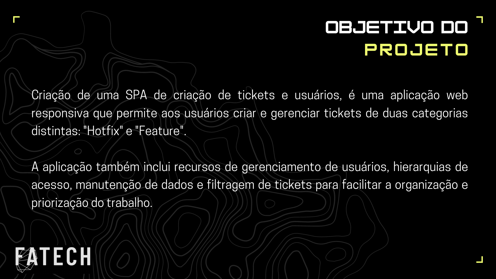
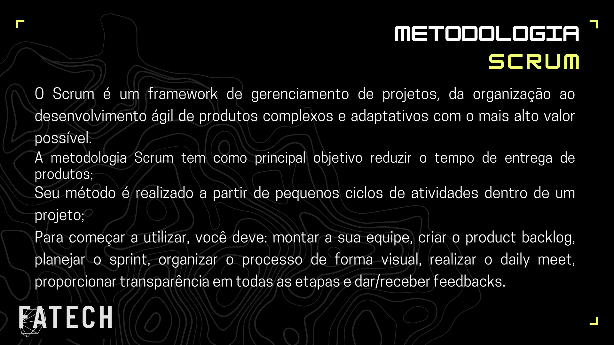
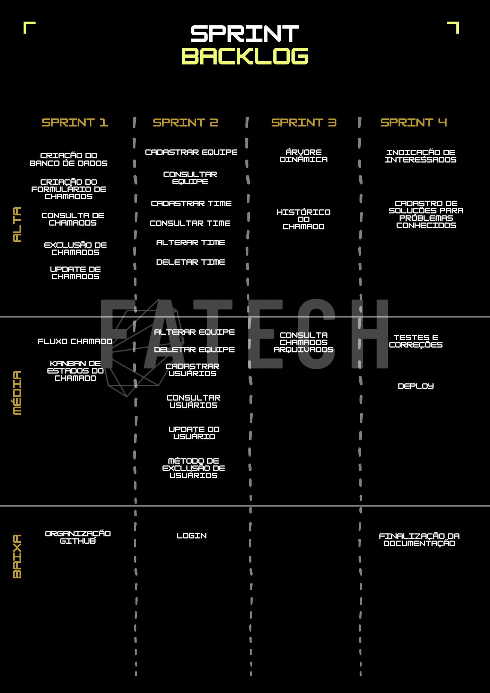

# API- Projeto Integrador 4º Semestre ADS - Grupo Fatech
Projeto desenvolvido por alunos do quarto semestre do curso de análise e desenvolvimento de sistemas da Fatec - SJC, durante o primeiro semestre do ano de 2023.

## 🎯 Objetivo

O projeto visa criar uma aplicação web (single-page application) de criação de tickets e usuários é uma aplicação web moderna e responsiva que permite aos usuários criar e gerenciar tickets de duas categorias distintas: "hotfix" e "feature". Os tickets "hotfix" são usados para problemas críticos que precisam ser resolvidos imediatamente, enquanto os tickets "feature" são usados para solicitações de novas funcionalidades ou melhorias no sistema.

Além disso, a aplicação permite aos usuários gerenciar usuários e suas permissões de acesso. Os usuários são organizados em hierarquias de acesso, com diferentes níveis de privilégio. Por exemplo, um administrador pode criar e gerenciar usuários, enquanto um usuário comum pode apenas visualizar e atualizar tickets.

Os tickets são categorizados por tipo, prioridade e departamento, para que possam ser facilmente filtrados e gerenciados. Os usuários podem visualizar todos os tickets que criaram ou que foram atribuídos a eles, e também podem atualizar o status dos tickets conforme necessário.

A aplicação também inclui recursos de manutenção, permitindo que os usuários gerenciem dados como departamentos, tipos de tickets e prioridades. Esses dados são usados para criar campos personalizados para os tickets e para categorizá-los de maneira adequada.

Com esses recursos, a single-page application de criação de tickets e usuários é uma solução completa para gerenciar solicitações de suporte e problemas relacionados à organização. Com um design moderno e responsivo, a aplicação é fácil de usar e pode ser acessada de qualquer lugar com uma conexão à internet.

> Status do Projeto: Em Desenvolvimento.

 

## 📩 Proposta
**Desenvolver um sistema web com os seguintes requisitos:**

> Requisitos Funcionais

- [X] Cadastros de grupos de usuários;
- [X] Permissão por grupo e por usuário;
- [X] Usuários devem ter distinção por times;
- [X] Fila de chamados por time;
- [X] Configuração e personalização de formulários de chamados;
- [ ] Árvore de decisão para escalonamento de chamados;
- [ ] Cadastro de soluções para problemas conhecidos;
- [ ] Formulário de abertura de chamado com indicação de interessados;

> Requisitos Não Funcionais

- [X] React;
- [X] NodeJS;
    
 ## 📅 Cronograma das Sprints 

 - - [X] **1° Sprint:**</a> 13/03/2023 a 02/04/2023 
 - - [X] **2° Sprint:**</a> 03/04/2023 a 23/04/2023
 - - [ ] **3° Sprint:**</a> 24/04/2023 a 14/05/2023
 - - [ ] **4°Sprint:** 15/05/2023 a 04/06/2023
 - - [ ] **Feira de Soluções:** 13/06 e 14/06/2023
 
  
    
 ## 💻 Tecnologias Utilizadas

 - **Back-end:** TypeScript, SQLite, NodeJS com o framework TypeORM.
- **Front-end:** Javascript utilizando React e o framework Tailwind CSS.
- **Ferramentas:** Visual Studio Code, Canva, Git, Github, PowerPoint, MySQL, Microsoft Teams e Discord.

## 💡 Metodologia

<ul> <li> <strong>Metodologia Ágil: SCRUM </strong> </li> </ul>
 

## 🗒️ Backlog Priorizado

 

## 2ª Entrega

## 📉 Gráfico Burndown

- <a href="docs/sprint1/Burndown Geral - sprint 1.pdf">**Sprint 1**</a>
- <a href="docs/sprint2/Burndown Geral - sprint 2.pdf">**Sprint 2**</a>
- <a href="docs/">**Sprint 3**</a>
- <a href="docs/">**Sprint 4**</a>
 
## 👥 Equipe

| Nome             | Função        | GitHub                                                                    | Linkedin                                                                                                       |
| ---------------- | ------------- | ------------------------------------------------------------------------- | -------------------------------------------------------------------------------------------------------------- |
| Everton Ricardo  | Master        | <a href="https://github.com/Evertonrwr" target="_blank">Github</a>        | <a href="https://www.linkedin.com/in/everton-rocha-1a456b20b" target="_blank">Link</a>                         |
| Gabriel Coutinho | Product Owner | <a href="https://github.com/Gabriel-Coutinho0" target="_blank">Github</a> | <a href="https://www.linkedin.com/in/gabriel-silva-b778a31aa" target="_blank">Link</a>                         |
| André Ribeiro    | Desenvolvedor | <a href="https://github.com/New-Tomorrow" target="_blank">Github</a>      | <a href="https://www.linkedin.com/in/andre-ramos-ribeiro-320621226/" target="_blank">Link</a>                  |
| Antônio Barbosa  | Desenvolvedor | <a href="https://github.com/Antonio-Barbosa" target="_blank">Github</a>   | <a href="https://www.linkedin.com/in/antonio-marcelo-9a5b68181" target="_blank">Link</a>                       |
| Bruna Dias       | Desenvolvedor | <a href="https://github.com/brunadias3" target="_blank">Github</a>        | <a href="https://www.linkedin.com/in/bruna-dias-977b611b9/" target="_blank">Link</a>                           |
| Dionísio Leão    | Desenvolvedor | <a href="https://github.com/dsslleagion" target="_blank">Github</a>       | <a href="https://www.linkedin.com/in/dionisio-samuel-dos-santos-le%C3%A3o-616848226/" target="_blank">Link</a> |
| Gustavo Lobato   | Desenvolvedor | <a href="https://github.com/Gustavoldp" target="_blank">Github</a>        | <a href="https://www.linkedin.com/in/gustavo-lobato-8173a11b6/" target="_blank">Link</a>                       |

 

 <h1 align="center"> 
